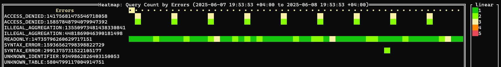
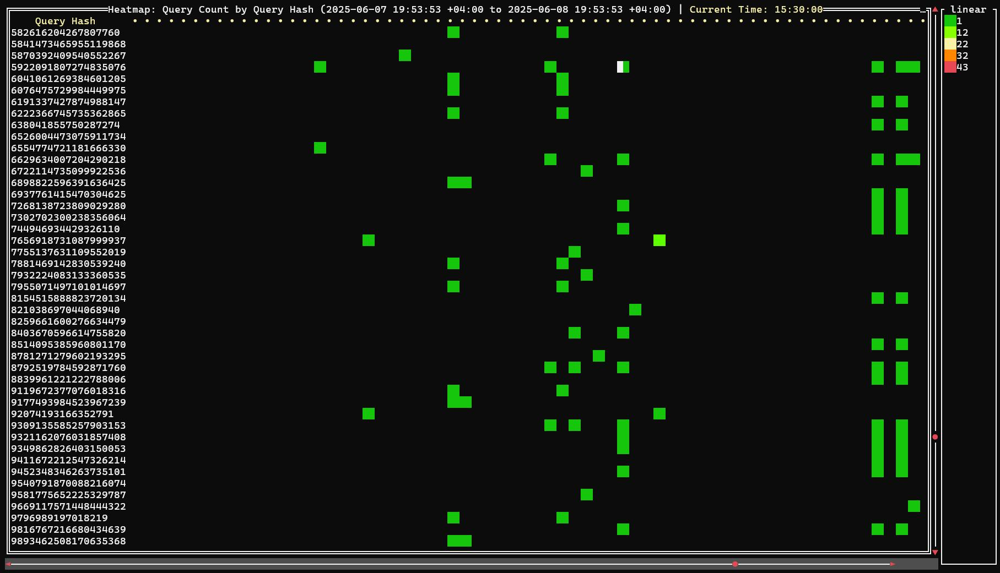
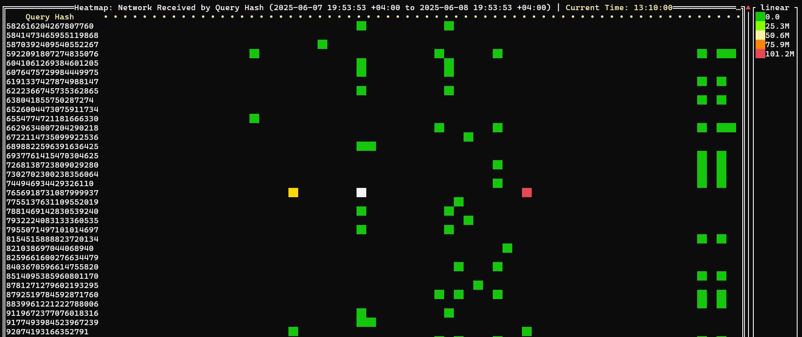
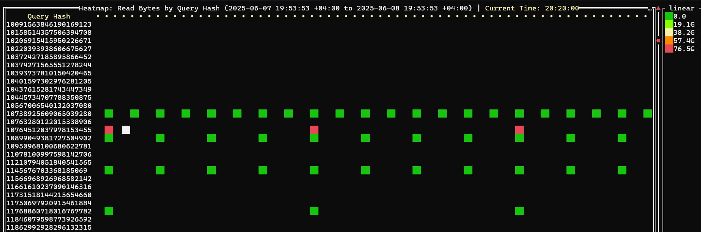

# clickhouse-timeline
Detailed timeline about queries in ClickHouse

Use `clickhouse-client` for query data
and https://github.com/zix99/rare for Heatmap Visualizations
and https://github.com/Slach/clickhouse-flamegraph for flamegraphs

Main idea template

```bash
clickhouse-clent -q "SELECT time, category, metric FROM system.query_log WHERE event_date=today() GROUP BY ALL" | rare heat -m "([^\t]+)\t([^\t]+)\t([^\t]+)" -e '{timeformat {time {1}} "15:04" }' -e "{2}" -e "{3}" --rows 50 --scale log2
```

[Timeline examples](./timeline-examples)

## Errors timeline `heatmap_errors.sh`

caregory is error name + normalized query hash


## Query finished timeline `heatmap_count.sh`



## Memory usage timeline `heatmap_memory.sh`


## CPU Usage timeline `heatmap_cpu.sh`


## Network send bytes timeline `heatmap_network_send.sh`


## Network receive bytes timeline `heatmap_network_receive.sh`



## Bytes read timeline `heatmap_read_bytes.sh`



## Bytes write timeline `heatmap_written_bytes.sh`


# Query analyze by normalized_query_hash

## Details about each query hash can bet get via EXPLAIN

```bash
clickhouse-client -q "SELECT DISTINCT 'EXPLAIN indexes=1 ' || query || ';' FROM system.query_log WHERE normalized_query_hash=? AND event_date=? AND event_time BETWEEN ? AND ? AND query_kind='Select' ORDER BY query_duration_ms DESC LIMIT 10 FORMAT TSVRaw" | clickhouse-client -mn --echo --output-format=PrettyCompactMonoBlock
```


## flamegraph for each query can be get via clickhouse-flamegraph

```bash
clickhouse-client -q "SELECT 'clickhouse-flamegraph --query-ids=' || arrayStringConcat(groupArray(10)(query_id),',') || '\n' FROM (SELECT query_id FROM system.query_log WHERE normalized_query_hash=? AND event_date=? AND event_time BETWEEN ? AND ? ORDER BY query_duration_ms DESC LIMIT 10) FORMAT TSVRaw" | bash
```
