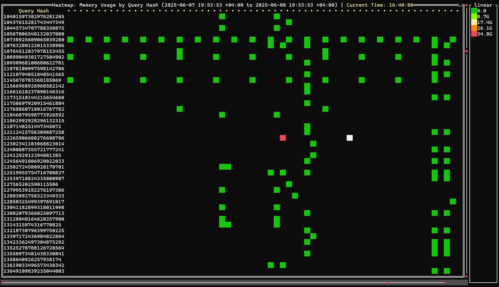
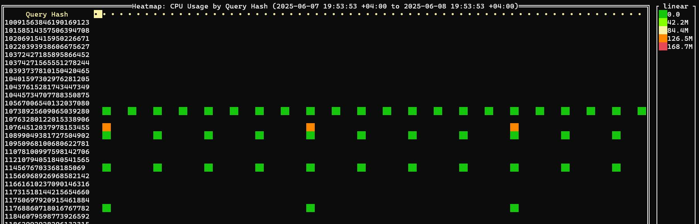
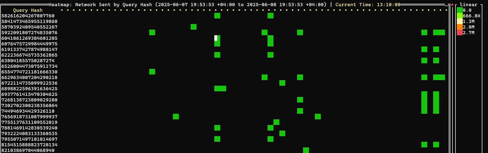

# ClickHouse Timeline

Interactive performance analysis tool for ClickHouse that provides detailed timeline visualizations of queries, system metrics, and logs.

## Features

- **Interactive TUI**: Terminal-based user interface for real-time analysis
- **Multiple Visualization Modes**: Heatmaps, flamegraphs, profile events, metrics, and logs
- **Time Range Analysis**: Flexible time range selection with predefined options
- **Query Performance**: Analyze queries by normalized hash, memory usage, CPU usage, and more
- **System Monitoring**: Monitor ClickHouse system metrics and events
- **Log Analysis**: Browse and filter ClickHouse logs with advanced search capabilities
- **System Audit**: Built-in system health checks and recommendations

## Installation

```bash
go install github.com/Slach/clickhouse-timeline@latest
```

## Usage

### Basic Usage

```bash
# Start interactive mode
clickhouse-timeline

# Connect to specific context and show heatmap
clickhouse-timeline --connect production --cluster main_cluster heatmap

# Analyze last 24 hours with specific metric
clickhouse-timeline --range 24h --metric memoryUsage --category query_hash heatmap
```

### Command Line Options

```bash
# Global flags
--config string          Path to config file (default: ~/.clickhouse-timeline/clickhouse-timeline.yml)
--log string             Path to log file (default: ~/.clickhouse-timeline/clickhouse-timeline.log)
--pprof                  Enable CPU and memory profiling
--pprof-path string      Path to store pprof files (default: ~/.clickhouse-timeline/)

# Time range options
--from string            Start time (any parsable format)
--to string              End time (any parsable format)  
--range string           Predefined time range (1h, 24h, 7d, etc.)

# Connection options
--connect string         ClickHouse connection context name from config
--cluster string         Cluster name to analyze

# Analysis options
--metric string          Metric to visualize (count, memoryUsage, cpuUsage, etc)
--category string        Category to group by (query_hash, tables, hosts, errors)
--flamegraph-native      Use native flamegraph viewer instead of flamelens
```

### Available Commands

#### Heatmap Analysis
```bash
clickhouse-timeline heatmap
```
Visualize query performance over time with color-coded heatmaps.


#### Flamegraph Analysis
```bash
clickhouse-timeline flamegraph
```
Interactive flamegraph viewer for query execution analysis.


#### Profile Events
```bash
clickhouse-timeline profile_events
```
Analyze ClickHouse profile events with statistical summaries.


#### Metric Log Analysis
```bash
clickhouse-timeline metric_log
```
Monitor system metrics over time with sparkline visualizations.


#### Asynchronous Metric Log
```bash
clickhouse-timeline asynchronous_metric_log
```
View asynchronous system metrics and their trends.


#### Log Analysis
```bash
clickhouse-timeline logs --database system --table text_log --message message --time event_time
```
Browse and filter ClickHouse logs with advanced search capabilities.


#### System Audit
```bash
clickhouse-timeline audit
```
Run comprehensive system health checks and get optimization recommendations.


## Visualization Types

### Heatmaps

#### Query Count Timeline
Track query execution frequency over time.


#### Memory Usage Timeline
Monitor memory consumption patterns by query hash.


#### CPU Usage Timeline
Analyze CPU utilization across different queries.


#### Network Traffic Timeline
Monitor network send and receive patterns.



#### Disk I/O Timeline
Track read and write operations over time.


#### Error Analysis Timeline
Identify error patterns and their frequency.


## Configuration

Create a configuration file at `~/.clickhouse-timeline/clickhouse-timeline.yml`:

```yaml
contexts:
  - name: "local"
    host: "localhost"
    port: 9000
    database: "default"
    username: "default"
    password: ""
    protocol: "native"
    secure: false
    tls_verify: false
  - name: "production"
    host: "prod-clickhouse.example.com"
    port: 9440
    database: "default"
    username: "readonly"
    password: "secret"
    protocol: "native"
    secure: true
    tls_verify: true
```

## Interactive Commands

Once in the TUI, use these commands:

- `:help` - Show this help
- `:connect` - Connect to a ClickHouse instance
- `:quit` - Exit the application
- `:flamegraph` - Generate a flamegraph
- `:from` - Set the start time
- `:to` - Set the end time
- `:range` - Set time range with predefined options
- `:heatmap` - Generate a heatmap visualization
- `:profile_events` - Show profile events
- `:category` - Set category for heatmap (query_hash, tables, hosts)
- `:cluster` - Select cluster for queries
- `:metric` - Select metric for heatmap visualization
- `:scale` - Set scale type for heatmap (linear, log2, log10)
- `:logs` - Show any table logs (text_log, query_log, query_thread_log)
- `:metric_log` - Show system.metric_log metrics
- `:asynchronous_metric_log` - Show system.asynchronous_metric_log metrics
- `:audit` - Run system audit and show diagnostics and suggestions

### Navigation:
- Use arrow keys to navigate
- Press / to filter connections list
- Press Esc to cancel current operation
- Press Enter in heatmap to show action menu
- Double click in heatmap to show action menu

## Query Analysis

### Analyze by Normalized Query Hash

Get detailed information about specific query patterns:

```bash
clickhouse-client -q "
SELECT DISTINCT 'EXPLAIN indexes=1 ' || query || ';' 
FROM system.query_log 
WHERE normalized_query_hash=? AND event_date=? AND event_time BETWEEN ? AND ? 
AND query_kind='Select' 
ORDER BY query_duration_ms DESC LIMIT 10 
FORMAT TSVRaw" | clickhouse-client -mn --echo --output-format=PrettyCompactMonoBlock
```

### Generate Flamegraphs for Query IDs

Create flamegraphs for the slowest queries:

```bash
clickhouse-client -q "
SELECT 'clickhouse-flamegraph --query-ids=' || arrayStringConcat(groupArray(10)(query_id),',') || '\n' 
FROM (
    SELECT query_id FROM system.query_log 
    WHERE normalized_query_hash=? AND event_date=? AND event_time BETWEEN ? AND ? 
    ORDER BY query_duration_ms DESC LIMIT 10
) FORMAT TSVRaw" | bash
```

## Requirements

- Go 1.24 or later
- ClickHouse server with system tables enabled
- Terminal with color support for best experience

## Contributing

Contributions are welcome! Please feel free to submit issues and pull requests.

## License

This project is licensed under the MIT License.
